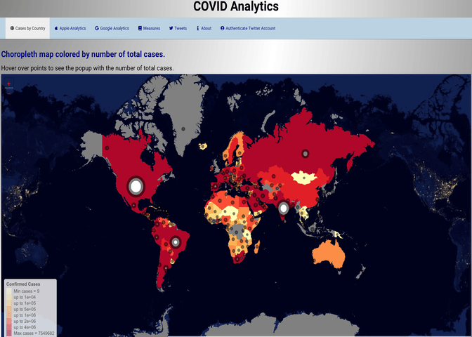
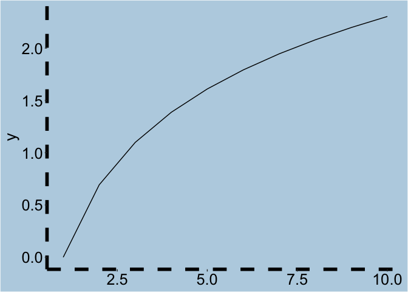

<!-- README.md is generated from README.Rmd. Please edit that file -->

# covidExplorer 

<!-- badges: start -->

[](https://github.com/etc5523-2020/r-package-assessment-petestylianos/actions)
<!-- badges: end -->

covidExplorer contains a Shiny app with summaries, analytics and news
related to COVID-19. Download the package and launch the Shiny app to
interactively browse data and news regarding the spread of COVID-19 in
various countries. The app also enables the user to scrape data from
Twitter. Refer to section [Twitter Tab](#tweet) for more info.

## Installation

You can install the current version from [GitHub](https://github.com/)
with:

``` r
# install.packages("devtools")
devtools::install_github("etc5523-2020/r-package-assessment-petestylianos")
```

## Example

To launch the app:

``` r
library(covidExplorer)
covidExplorer::launch_app()
```

<p>



</p>

## Twitter Tab

To be able to search Twitter on your RSudio you need to be able to run
the following commands:

api\_key \<- ‘YOUR API KEY’

api\_secret \<- ‘YOUR API SECRET’

access\_token \<- ‘YOUR ACCESS TOKEN’

access\_token\_secret \<- ‘YOUR ACCESS TOKEN SECRET’

setup\_twitter\_oauth(api\_key,api\_secret)

To obtain this tokens and keys you need to log in to Twitter with your
account, or create one if necessary. Then you need to setup an
application: click on “My Applications” and then click on “Create new
application”. Almost thre, fill in the blank boxes and a new screen will
appear with your private keys and token. The final step is to install
twitteR from GitHub using the devtools package and run the first 5
commands at the beginning of the section. For further instruction refer
to: [Twitter Authentication with
R](%22http://thinktostart.com/twitter-authentification-with-r/%22),
[Authenticate.twitter](%22https://www.rdocumentation.org/packages/vosonSML/versions/0.29.10/topics/Authenticate.twitter%22)
and [Twitter Authentication with
R](%22https://www.r-bloggers.com/2016/01/twitter-authentication-with-r/%22).

## Required Packages

In order for all tabs of the app to work properly you need to have the
following packages installed:

``` r
library(classInt)
library(coronavirus)
library(COVID19)
library(DT)
library(leaflet)
library(ggthemes)
library(glue)
library(htmlwidgets)
library(maps)
library(patchwork)
library(plotly)
library(RColorBrewer)
library(scales)
library(shiny)
library(shinycssloaders)
library(shinydashboard)
library(shinydashboardPlus)
library(shinythemes)
library(shinyWidgets)
library(stringr)
library(tidycovid19)
library(tidytext)
library(dplyr)
library(twitteR)
```

## Exported Fucntions

**my\_theme()**

Use it to add the custom theme found in the app’s figures

``` r
library(tibble)
library(ggplot2)

 df <- tibble(x = 1:10,
               y = log(x))
 fig <- ggplot(df, aes(x, y)) +
   geom_line()
 
 covidExplorer::my_theme(fig)
```


